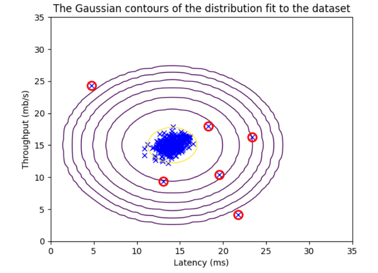

# Anomaly Detection Algorithm for Server Health Monitoring

## 📌 Overview  
This project implements an **anomaly detection algorithm** to identify failing servers in a network based on system health metrics.  
The algorithm models the distribution of server features and flags unusual behavior as potential anomalies, enabling proactive detection of failures.

---

## 🛠️ Tools & Technologies  
- Python, Jupyter Notebook  
- NumPy / Pandas for data manipulation  
- Matplotlib for visualization  
- Gaussian distribution + anomaly detection algorithm  

---

## 📂 Dataset  
- Simulated dataset representing **server performance metrics**  
- Features include **latency (ms)** and **throughput (mb/s)**  
- Goal: detect unusual server activity that may indicate failure  

---

## 🔍 Methodology  
1. **Feature Analysis**  
   - Extract latency and throughput as server health indicators  
   - Standardize features for distribution fitting  
2. **Modeling with Gaussian Distribution**  
   - Estimate parameters μ (mean) and σ² (variance)  
   - Fit Gaussian contours to normal server data  
3. **Threshold Selection**  
   - Cross-validation to find best epsilon (anomaly threshold)  
   - Use F1-score to balance precision vs recall  
4. **Anomaly Detection**  
   - Instances outside the probability threshold flagged as anomalies  
   - Visualize anomalies with Gaussian contours  

---

## 📊 Results & Insights  
- **Best epsilon (threshold):** 1.377229e-18  
- **Best F1-score (cross-validation):** 0.615  
- **Anomalies flagged:** 117 instances  
- Algorithm successfully detected failing server behavior beyond normal distribution bounds  

---

## 📈 Example Visuals  

Gaussian contours of server health data with anomalies (red markers):  



---

## 🚀 How to Run This Project  
1. Clone this repository:  
   ```bash
   git clone https://github.com/Josefxl/Anomaly_Detection_Algorithm_for_Server_Health_Monitoring.git
